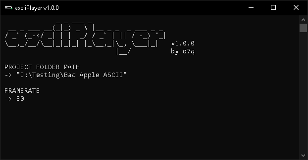

# [<b>>> Download Latest</b>](https://github.com/o7q/img2ascii/releases/download/v2.1.0.0/img2ascii.v2.1.0.0.zip)
<h3>Welcome! img2ascii is a simple, command-line based tool that allows you to turn images and videos into ASCII art.</h3>

---

Example with the video <b>[Bad Apple!!](https://www.youtube.com/watch?v=FtutLA63Cp8)</b> \

---

# Overview 
img2ascii allows you to convert any media format into ASCII art! I made this program as a challenge to see if I could convert a video into ASCII art basically from scratch. * **FFmpeg** and **stb_image** carries a little for the first processing step.

This program turns any media format into an ASCII text sequence which can be played via `asciiPlayer.exe`. \
*It does not turn it into a video afterwards! If you want it in video form you will need to record the command window.*

### <b>Powered by</b>
FFmpeg: https://ffmpeg.org \
stb: https://github.com/nothings/stb

---

# Usage

**Note:** While using asciiPlayer, if the command window starts bugging out that means your output frames are bigger than what can be displayed with word wrap. To fix this, maximize the command window while it's playing, hold ctrl + scroll-down to zoom out, un-maximize the command window and re-maximize it, if that doesn't work then just fiddle around with it until it does. You will get the hang of it.

## <b>Interface</b>
- ### <b>img2ascii</b>
    - <b>Project Name</b> Specify a folder name for the final render
    - <b>Input Media Path</b> Specify the input image/video to be converted into ASCII
    - <b>Frame Size</b> Specify the width and height of the final ASCII image (example: 100x50)
    - <b>Frame Rate</b> Rate at which frames are skipped, this is basically the fps of the final render (type ! to skip this option or if it is an image)
    - <b>ASCII Characters</b> Specify which ASCII characters you want to be included in the final ASCII image. You can choose a number or enter your own in brightness levels low to high
    - <b>ASCII Compression</b> Specify a compression amount for the final render (0 - 255, higher values means higher compression resulting in the final render having less ASCII characters)
    - <b>JPEG Compression</b> Specify a compression amount for the JPEG frames (1 - 31, higher values means higher compression resulting in JPEG artifacts)
- ### <b>asciiPlayer</b>
    - <b>Project Folder Path</b> Folder path to play frames from
    - <b>Playback Framerate</b> Playback rate of frames (does not skip frames, it frame drops instead)

---

<b>img2ascii</b> \
Written in C++ and compiled using MinGW G++

<b>asciiPlayer</b> \
Written in C++ and compiled using MinGW G++