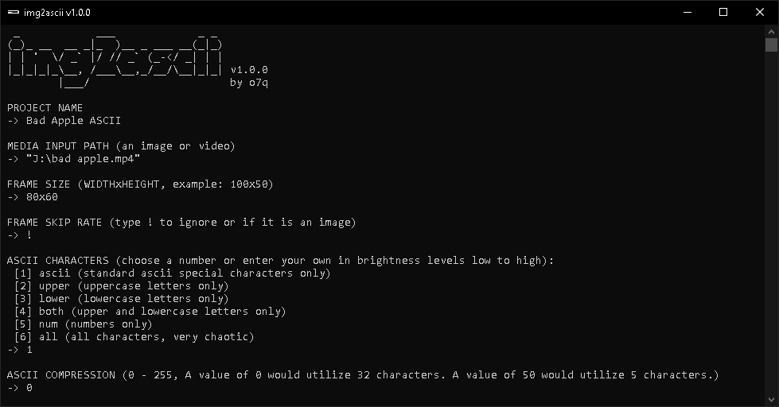

### <b>THIS PROGRAM IS STILL IN DEVELOPMENT, IT HAS NOT BEEN RELEASED YET</b>

---


<!-- # [<b>>> Download Latest</b>](https://github.com/o7q/img2ascii/releases/download/v1.0.0/img2ascii.v1.0.0.zip) -->
<h3>Welcome! img2ascii is a simple, command-line based tool that allows you to turn images and videos into ascii art.</h3>

<!-- ---

 -->

---

# Overview
img2ascii allows you to convert any media format into ascii art! I made this program as a challenge to see if I could convert a video into ascii basically from scratch. * FFmpeg carries a little for the first processing step.

This program turns any media format into an ASCII text sequence which can be played via `asciiPlayer.exe`. \
*It does not turn it into a video afterwards!If you want it in video form you will need to record the command window.*

### <b>Powered by</b>
FFmpeg: https://ffmpeg.org

---

# Usage

## <b>Installation</b>
A lot of antiviruses flag my `img2rgb` module, it is a precompiled python executable. It does not contain any viruses but if you are being safe you can compile it yourself.

- <b>Normal Installation</b> \
<b>1.</b> Download from https://github.com/o7q/img2ascii/releases

- <b>Python Installation</b> \
<b>1.</b> Install python from https://www.python.org/downloads \
<b>2.</b> Open a command window and run the following commands:
```powershell
pip install Pillow
```
```powershell
pip install pyinstaller
```
- \
    <b>3.</b> Download the folder `src/img2rgb` \
    <b>4.</b> Run `compile.bat` \
    <b>5.</b> Place `img2rgb.exe` in the same folder as `img2ascii.exe` and `asciiPlayer.exe`

<br>

## <b>Interface</b>
- ### <b>img2ascii</b>
    - <b>Project Name</b> Specify a folder name for the final render
    - <b>Input Media Path</b> Specify the input image/video to be converted to ASCII
    - <b>Frame Size</b> Specify the width and height of the final ASCII image (example: 100x50)
    - <b>Frame Skip Rate</b> Rate at which frames are skipped, this is basically the fps of the final render (type ! if it is not a video)
    - <b>ASCII Characters</b> Specify which ASCII characters you want to be included in the final ASCII image. You can choose a number or enter your own in brightness levels low to high
    - <b>ASCII Compression</b> Specify a compression amount for the final render (higher values means higher compression resulting in the final render having less ascii characters)
- ### <b>asciiPlayer</b>
    - <b>Project Folder Path</b> Folder path to play frames from
    - <b>Framerate</b> Playback rate of frames (does not skip frames, it framedrops instead)

---

<b>img2ascii</b> \
Programmed with C++ and compiled using MinGW G++

<b>asciiPlayer</b> \
Programmed with C++ and compiled using MinGW G++

<b>img2rgb</b> \
Programmed with Python and compiled using Pyinstaller